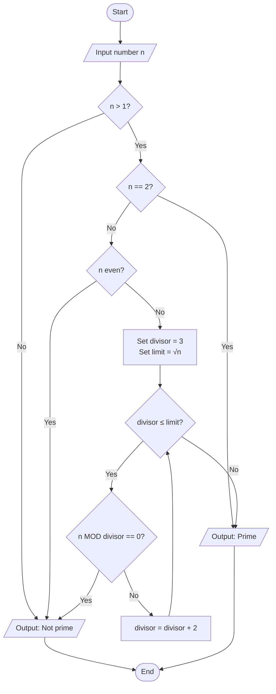
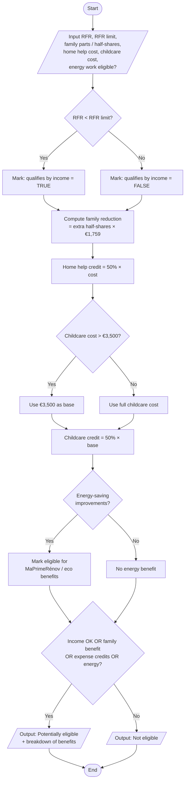

## Case 1 — Check if a number is prime

### Definition
A **prime number** is a natural number greater than 1 that can be divided only by 1 and itself (not a product of two smaller natural numbers).

---

### Pseudocode — Prime check

```
ALGORITHM IsPrime(n)
BEGIN
    INPUT n

    IF n <= 1 THEN
        OUTPUT "Not prime"
        STOP
    END IF

    IF n == 2 THEN
        OUTPUT "Prime"
        STOP
    END IF

    IF n is even THEN
        OUTPUT "Not prime"
        STOP
    END IF

    SET divisor ← 3
    SET limit ← square_root(n)

    WHILE divisor <= limit DO
        IF n MOD divisor == 0 THEN
            OUTPUT "Not prime"
            STOP
        END IF
        SET divisor ← divisor + 2
    END WHILE

    OUTPUT "Prime"
END
```

**Notes**
- Numbers ≤ 1 are never prime.
- 2 is the only even prime.
- We only test odd divisors up to √n (enough to prove primality).

---

### Flowchart — Prime check




---

## Case 2 — French tax deduction eligibility

### Rules summarized
1. **RFR income threshold** — Tax reference income (revenu fiscal de référence) must be below the official annual limit to qualify for certain reductions/exemptions.
2. **Family quotient (quotient familial)** — More dependents → more household parts → lower taxable income. Tax reduction per half-share is capped (**€1,759 in 2024**).
3. **Deductible expenses / credits** — Eligible life expenses can create reductions/credits, for example:
   - Home help (cleaners, nannies): **50% credit** on eligible costs
   - Childcare for children under 6: **50% credit** on up to **€3,500** of expenses
   - Energy-saving home improvements: **MaPrimeRénov** / other eco-tax benefits

---

### Pseudocode — French tax deduction check

```
ALGORITHM FrenchTaxDeductionCheck
BEGIN
    INPUT rfr                    // tax reference income
    INPUT rfr_limit              // official annual RFR threshold
    INPUT household_parts        // quotient familial parts
    INPUT half_shares_extra      // extra half-shares beyond base
    INPUT home_help_cost
    INPUT childcare_cost         // for children under 6
    INPUT energy_improvement_eligible   // true/false
    CONSTANT HALF_SHARE_CAP ← 1759      // €, year 2024
    CONSTANT CHILDCARE_CAP ← 3500

    SET qualifies_by_income ← FALSE
    SET family_reduction ← 0
    SET expense_credits ← 0
    SET eligible ← FALSE

    // Rule 1 — Income threshold (RFR)
    IF rfr < rfr_limit THEN
        SET qualifies_by_income ← TRUE
    ELSE
        SET qualifies_by_income ← FALSE
    END IF

    // Rule 2 — Family quotient advantage (capped per half-share)
    SET family_reduction ← half_shares_extra * HALF_SHARE_CAP
    // Note: actual tax calc uses parts; here we model the half-share cap benefit

    // Rule 3 — Deductible expenses and credits
    SET home_help_credit ← 0.50 * home_help_cost

    IF childcare_cost > CHILDCARE_CAP THEN
        SET childcare_base ← CHILDCARE_CAP
    ELSE
        SET childcare_base ← childcare_cost
    END IF
    SET childcare_credit ← 0.50 * childcare_base

    SET energy_benefit ← 0
    IF energy_improvement_eligible == TRUE THEN
        SET energy_benefit ← "eligible for MaPrimeRénov / eco-tax benefits"
        // amount depends on work type and household; flag eligibility here
    END IF

    SET expense_credits ← home_help_credit + childcare_credit

    // Overall eligibility decision
    IF qualifies_by_income == TRUE OR family_reduction > 0 OR expense_credits > 0 OR energy_improvement_eligible == TRUE THEN
        SET eligible ← TRUE
        OUTPUT "Potentially eligible for French tax reductions/credits"
        OUTPUT "RFR qualifies:", qualifies_by_income
        OUTPUT "Family quotient reduction (capped model):", family_reduction
        OUTPUT "Expense credits:", expense_credits
        OUTPUT "Energy benefits:", energy_benefit
    ELSE
        SET eligible ← FALSE
        OUTPUT "Not eligible under the checked rules"
    END IF
END
```

---

### Flowchart — French tax deduction




---


